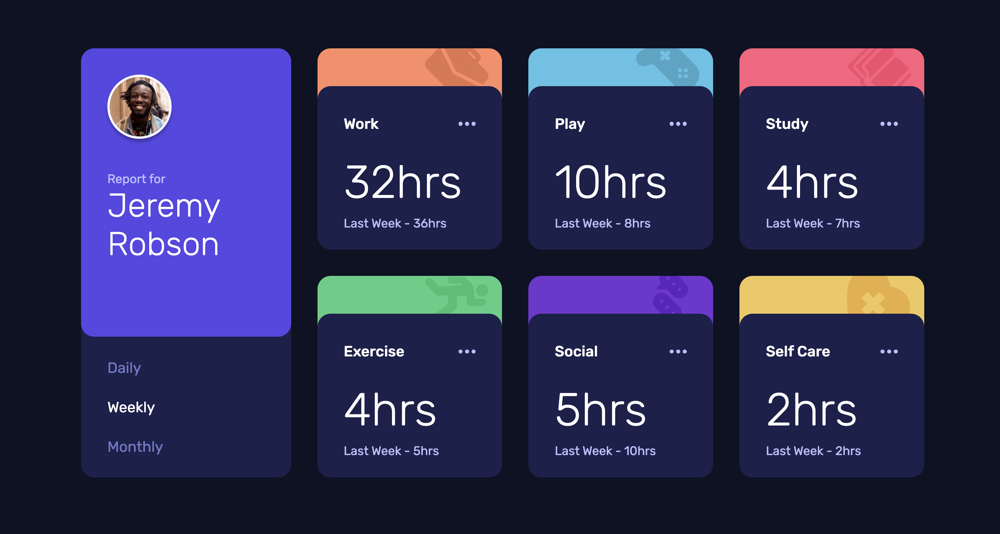

# Time Tracking Dashboard

## Table of contents

- [Overview](#overview)
  - [Screenshot](#screenshot)
  - [Links](#links)
- [My process](#my-process)
  - [Built with](#built-with)
- [Author](#author)

## Overview

### Screenshot

### Links

- Solution URL: [Solution URL](https://github.com/kisu-seo/time_tracking_dashboard)
- Live Site URL: [Live URL](https://kisu-seo.github.io/time_tracking_dashboard/)

## My process

### Built with

- **React 19** — Component-based architecture. The UI is composed of three focused, reusable components (`App`, `ProfileCard`, `ActivityCard`) that each have a single responsibility, ensuring clean separation of concerns and easy maintainability.
- **Vite 8** — Used as the build tool and development server for near-instant HMR (Hot Module Replacement) and optimized production bundling via `@vitejs/plugin-react`.
- **Tailwind CSS v3** — All styling implemented exclusively through utility classes with zero custom CSS. Design system tokens (custom color palette, Rubik font family) are centrally defined in `tailwind.config.js` as a Single Source of Truth (SSOT). Leverages `lg:hover:` responsive prefix for desktop-only hover interactions to prevent sticky-hover bugs on touch devices.
- **React Hook (`useState`)** — The active timeframe state (`'daily'` | `'weekly'` | `'monthly'`) is owned by `App` and lifted to the common ancestor following the standard "Lifting State Up" pattern. `ProfileCard` reads and mutates the state; `ActivityCard` consumes it read-only — establishing a clear, unidirectional data flow.
- **Data-Driven Rendering** — Activity data is stored in a single `data.json` file (the sole source of truth for time values). A dedicated transform layer (`src/data/activities.js`) merges the raw JSON with UI theme metadata (Tailwind `colorClass` and icon paths) via a `THEME_MAP` before passing the enriched data to components via `.map()`.
- **Semantic HTML5 & Web Accessibility (A11y)**
  - Semantic landmarks (`<main>`, `<nav>`, `<article>`) used throughout for a meaningful document outline.
  - `<nav>` for the timeframe selector uses `aria-label="시간대 선택"` to be identified by screen readers.
  - Each tab `<button>` uses `aria-pressed` to communicate the currently active state to assistive technology.
  - Decorative icons (activity icons, ellipsis) are hidden from assistive technology with `aria-hidden="true"`, while the ellipsis `<button>` carries a descriptive `aria-label` (e.g. "Work 더 보기").
- **Rubik Variable Font** — Loaded via Google Fonts CDN (`@import` in `index.css`) with weights 300, 400, and 500, covering all typographic presets defined in the style guide with a single font family declaration.
- **Mobile-First Responsive Layout** — Layouts are designed from the smallest screen up and progressively enhanced across three breakpoints:
  - **Mobile**: Single-column flex stack with `px-6 / py-[81px]` padding.
  - **Tablet (md: 768px+)**: Activity cards switch to a 3-column grid; ProfileCard adapts its internal layout.
  - **Desktop (lg: 1024px+)**: Root layout becomes a 2-column CSS Grid (`grid-cols-[255px_1fr]`), pinning the ProfileCard at a fixed 255px width while the activity grid fills the remaining space.
- **PostCSS & Autoprefixer** — PostCSS processes Tailwind's directives; Autoprefixer automatically adds vendor prefixes to ensure cross-browser CSS compatibility.

## Author

- Website - [Kisu Seo](https://github.com/kisu-seo)
- Frontend Mentor - [@kisu-seo](https://www.frontendmentor.io/profile/kisu-seo)
